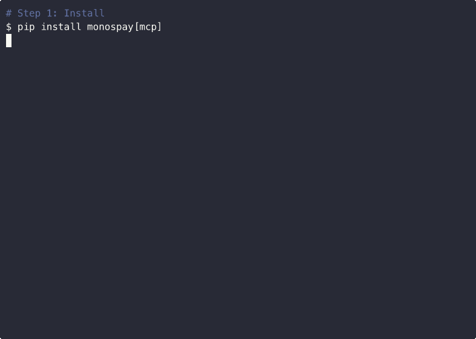

# monospay

[](https://pypi.org/project/monospay/)
[](https://pypi.org/project/monospay/)
[](https://opensource.org/licenses/MIT)


Payment infrastructure for AI agents.  
`pip install monospay` · Your agent can pay.



---

## Install

```bash
pip install "monospay[mcp]"
```

Then run:

```bash
mono-mcp
```

```
  monospay · payment infrastructure for AI agents
  ─────────────────────────────────────────────────

  Almost there! Two steps to connect your agent:

  1. Get your keys at monospay.com/dashboard
     → Agents → select agent → Issue API key

  2. export MONO_API_KEY=mono_live_...
     export MONO_PRIVATE_KEY=0x...
```

Set your keys, run `mono-mcp` again:

```
  ✓ monospay ready — your agent can pay.
    Tools: mono_balance, mono_transfer, mono_transactions
```

Works on macOS, Linux, Windows · Python 3.9+

---

## How it works

mono is for **developers building AI agents** — not end users.

```
1. You create agents on monospay.com/dashboard
2. Each agent gets a unique ID and API key
3. Your code uses the SDK to transfer USDC between agents automatically
```

The agent names come from your dashboard. You wire them up in your code once — then agents pay each other autonomously.

---

## Python SDK — Quickstart

```python
from mono_sdk import MonoClient

# Each agent has its own API key (from dashboard -> Agents -> Issue API key)
agent_a = MonoClient(api_key="mono_live_...")

# Agent A checks its balance
balance = agent_a.balance()
print(f"Budget: ${balance['available_usdc']}")  # -> Budget: $50.00

# Agent A pays Agent B (zero-trust, ECDSA-signed)
result = agent_a.signed_transfer(
    to_wallet="0x...",
    amount=1.50,
    private_key="0x...",
)
print(result["transaction_id"])
```

No wallets to manage. No gas. No KYC.

---

## Security

- All transfers are cryptographically signed — no API key can move funds
- Replay protection built in
- Server-side spending limits and daily budgets
- Open-source smart contract on [Base](https://basescan.org/address/0xA9DC3105ec1A84E4Bc3c9702dFC772a6efA2CDBA) (verified)

> See [SECURITY.md](SECURITY.md) for technical details on the signing protocol.

### Using the SDK

```python
from mono_sdk import MonoClient

client = MonoClient(api_key="mono_live_...")

result = client.signed_transfer(
    to_wallet="0xReceiverAddress",
    amount=5.00,
    private_key="0xYourPrivateKey",
)
# -> { "transaction_id": "...", "sender_new_balance": 45.0 }
```

> **Deprecated:** `transfer()` and `settle()` are permanently disabled. Use `signed_transfer()` or MCP tools instead.

---

## 2-Agent Example

```python
from mono_sdk import MonoClient

agent_a = MonoClient(api_key="mono_live_A...")
agent_b = MonoClient(api_key="mono_live_B...")

# Agent A pays Agent B (ECDSA-signed)
agent_a.signed_transfer(
    to_wallet="0xAgentB_Wallet",
    amount=0.50,
    private_key="0xAgentA_Key",
)
print(f"A balance: ${agent_a.balance()['available_usdc']}")
print(f"B balance: ${agent_b.balance()['available_usdc']}")
```

---

## CLI — for developers

The CLI lets you inspect and manage your agents from the terminal.

```bash
mono balance          # Show your agent's balance
mono health           # Check gateway status
mono config show      # Show current config
```

---

## LangChain

```bash
pip install "monospay[langchain]"
```

```python
from mono_sdk.langchain_tools import MonoToolkit

toolkit = MonoToolkit(api_key="mono_live_...")
tools   = toolkit.get_tools()
```

---

## MCP Server

Works with Claude Desktop, Cursor, Windsurf, and any MCP-compatible agent.

Add to your Claude Desktop config (`claude_desktop_config.json`):

```json
{
  "mcpServers": {
    "monospay": {
      "command": "npx",
      "args": ["-y", "monospay-mcp"],
      "env": {
        "MONO_API_KEY": "mono_live_...",
        "MONO_PRIVATE_KEY": "0x..."
      }
    }
  }
}
```

No install needed — `npx` downloads and runs it automatically.

<details>
<summary>Alternative: pip / uvx</summary>

```bash
pip install "monospay[mcp]"
mono-mcp
```

Or with uvx: `uvx --from "monospay[mcp]" mono-mcp`
</details>

Available tools: `mono_balance`, `mono_transfer`, `mono_transactions`, `mono_health`.

---

## OpenAI Function Calling

```python
from mono_sdk.openai_functions import get_mono_tools, handle_tool_call

tools = get_mono_tools()
# Pass tools to your OpenAI chat completion
```

---

## Error handling

```python
from mono_sdk.errors import InsufficientBalanceError, AuthenticationError

try:
    agent_a.signed_transfer(to_wallet="0x...", amount=999.00, private_key="0x...")
except InsufficientBalanceError:
    print("Out of budget — top up at monospay.com/dashboard")
except AuthenticationError:
    print("Invalid key — run: mono init")
```

---

## Why monospay

- **10 minutes to first payment** — `pip install`, set keys, your agent pays
- **Works with every AI framework** — LangChain, CrewAI, OpenAI, Claude, Cursor, Google ADK
- **Sub-cent transactions** — no $0.30 minimum like card networks
- **Agents don't need bank accounts** — just a wallet and a private key
- **You stay in control** — spending limits, daily budgets, transaction history

---

## Links

- Dashboard · [monospay.com](https://monospay.com)
- Docs · [monospay.com/docs](https://monospay.com/docs)
- PyPI · [monospay](https://pypi.org/project/monospay/)
- Contract · [BaseScan 0xA9DC3105...](https://basescan.org/address/0xA9DC3105ec1A84E4Bc3c9702dFC772a6efA2CDBA)
- Built on [Base](https://base.org) · Settled in [USDC](https://www.circle.com/usdc)
